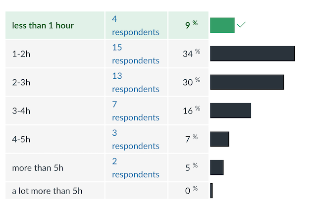
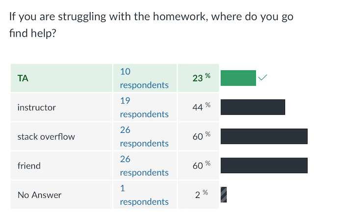

# This is what you said ... about the homework

## How much time do you usually spend on the homework?

## Where do you go and find help?

It's Qinglong's job to help you: W1-2,  Snedecor 3207, qltian@iastate.edu

## About the homework

- ~~You can't start working on the homework before Tuesday, because you don't know all of the concepts yet~~ 
- ~~You need to know commands that were not taught in class in order to solve the homework~~ 
- All homework assignments cover only material up to/including the Thursday when it is posed.
- If you think you cannot solve the homework with tools we have covered you have missed something.
- "It is hard to figure out what a question asks for" ... I agree. Most is intentional, but maybe not all. I will work on that.

## Vague question of homework #5

Investigate the relationship between gender and the variables `Do.you.have.any.children.under.18.` and `baby.on.plane`.

How is the attitude towards babies on planes shaped by gender and own children under 18? 

Find a plot that summarises your findings (use  `ggplot2`).

## About this class

 This is a *programming* class; programming with data is going to empower you for the rest of your careers as statisticians
 

> The bad news is that whenever you learn a new skill you're going to
> suck. It's going to be frustrating. The good news is that this is typical and
> happens to everyone and it is only temporary. You can't go from knowing
> nothing to becoming an expert without going through a period of great
> frustration and great suckiness.

**Hadley Wickham **

