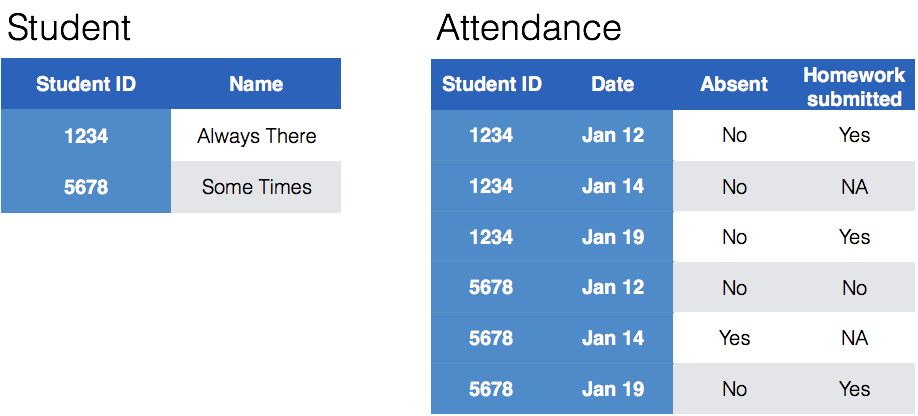

```{r setup, include=FALSE}
knitr::opts_chunk$set(echo = TRUE)
library(tidyverse)
```

# Dealing with Messy (3) and (4)

# Keys and Measurements

## Finding your keys - Example (1)

100 patients are randomly assigned to a treatment for heart attack, measured 5 different clinical outcomes.

## Finding your keys - Example (1)

100  patients are randomly assigned to a treatment for heart attack, measured 5 different clinical outcomes.

- key: patient ID
- factor variable (design): treatment
- measured variables: 5 clinical outcomes

## Finding your keys - Example (2)

Randomized complete block trial with four fields, four different types of fertilizer, over four years.  Recorded total corn yield, and fertilizer run off

## Finding your keys - Example (2)

Randomized complete block trial with four fields, four different types of fertilizer, over four years.  Recorded total corn yield, and fertilizer run off

- key: fields, types of fertilizer, year
- measurement: total corn yield, fertilizer run off


## Finding your keys - Example (3)

Cluster sample of twenty students in thirty different schools.  For each school, recorded distance from ice rink.  For each student, asked how often they go ice skating, and whether or not their parents like ice skating


## Finding your keys - Example (3)

Cluster sample of twenty students in thirty different schools.  For each school, recorded distance from ice rink.  For each student, asked how often they go ice skating, and whether or not their parents like ice skating

- key: student ID, school ID
- measurement: distance to rink, #times ice skating, parents' preference


## Finding your keys - Example (4)

For each person, recorded age, sex, height and target weight, and then at multiple times recorded their weight

## Finding your keys - Example (4)

For each person, recorded age, sex, height and target weight, and then at multiple times recorded their weight

- key: *patient ID*, date
- measurement: *age, sex, height, target weight*, current weight

*only patient ID is needed for variables in italics*

## Messy (3)

Messy (3): *Multiple observational units are stored in the same table.*

What does that mean? The *key is split*, i.e. for some values all key variables are necessary, while other values only need some key variables.


## Why do we need to take care of split keys?

- Data redundancy introduces potential problems (same student *should* have the same student ID)
- to check data consistency, we split data set into parts - this process is called *normalizing*
- normalization reduces overall data size
- useful way of thinking about objects under study


## Tidying Messy (3)

Splitting into separate datasets:



## Example: Box office gross

The-Numbers website publishes [weekly charts](http://www.the-numbers.com/weekend-box-office-chart) of the gross income of all movies playing across the US. A set of [scraped data](../data/boxoffice.csv) with movies for the last two years is available in the repo.

```{r echo = FALSE}
box <- read.csv("../data/boxoffice-cleaned.csv")
head(box, 4)
```

What are the key variables? Why is the key split?

## Keys and measurements

- Measurement variables: `Gross`, `Thtrs.`
- Key variables: `Movie` name,  `Date` and `Distributor`. 
- All other variables are derived from these variables
- good practice: re-calculate the derived variabes to check for consistency. 

## Taking care of the split key

Plan: separate movie information from box office information

First idea: take all unique combinations of Movie and Distributor

```{r}
movies <- box %>% select(Movie, Distributor) %>% unique()
```

Does that make a movie unique?

```{r}
movies %>% count(Movie) %>% arrange(desc(n))
```

## Split key - take 2

Second idea: ideally we would like a release date. BUT: we only have Week info. 

Get the Week info  for the first time we see  each Movie and Distributor combo:

```{r}
box <- box %>% group_by(Movie, Distributor) %>% 
  mutate(firstSeen = min(Week))
head(box)
```

## Movie data

Now extract all the information for movies we first see:
```{r}
movies <- box %>% filter(Week == firstSeen) %>% select(Movie, Distributor, Date, Week)
movies %>% arrange(desc(Week))
```

