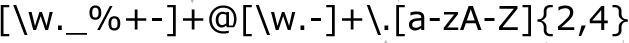

## Regular Expressions - working with text



## [xkcd #208](https://xkcd.com/208/)


## An example

- Baby Name Wizard: NameVoyager (Martin Wattenberg, 2000)
- http://www.babynamewizard.com/voyager
- Explores popularity of names over the last century: boys' and grils' names in top 1000 since 1880 are included

## Your Turn (6 mins) {.white}


<span style="color:white">For this exercise, go to the Baby Name wizard at http://www.babynamewizard.com/voyager
</span>

- <span style="color:white">When was your name the most popular since 1880?
</span>
- <span style="color:white">How popular are names starting with 'A'?
</span>
- <span style="color:white">Are names ending on 'e' more likely to be girls' or boys' names?
</span>

## `stringr` package

1. Character manipulation:  functions to allow you to manipulate individual characters within the strings in character vectors.
2. Whitespace tools: add, remove, and manipulate whitespace.
3. Locale sensitive operations.
4. Pattern matching functions: most common is regular expressions.

## Babynames in R

Top 1000 baby names from 1880 to 2015 based on Social Security Agency

```{r, warning=FALSE, message=FALSE}
library(tidyverse)
library(babynames)
head(babynames)

bn <- sample(babynames$name, size = 10)
bn
```

## `str_length`

Extract the number of characters in a character vector

```{r}
bn

library(stringr)
str_length(bn)
```

## Length of babies' names

```{r, fig.height = 4}
babynames$length = str_length(babynames$name)

babynames %>% ggplot(aes(x = length, weight = prop)) + 
  geom_bar() + 
  facet_wrap(~sex)
```

## `str_sub`

- `str_sub(string, start = 1L, end = -1L)` extract sub strings from start to end
```{r}
bn
str_sub(bn, start=2, end = 2) # second character
```

## Your Turn (6 mins) {.white}


<span style="color:white">For this exercise, use the `babynames` dataset provided in the R package `babynames`.
</span>

- <span style="color:white">Introduce a variable `length` into the baby names data that contains the length of each name
</span>
- <span style="color:white">Extract the first letter of each name. Visualize in a barchart, facet by Gender.
</span>
- <span style="color:white">Extract the last letter of each name. Visualize in a barchart, facet by Gender.
</span>


## Regular Expressions

- A regular expression (regex, regexp) is a sequence of characters that form a search pattern
- Originated in 1950s. American mathematician Stephen Kleene formalized the description of a regular language.
-  Common usage with Unix text processing utilities ed, an editor, and grep (global regular expression print), a filter.
- R language provides this capability through various functions.


## Regular expressions in the `stringr` package

- `str_detect(strings, pattern)`: binary result: is pattern in string? 
- `str_count(strings, pattern)`: integer: how often is pattern in string? 
- `str_locate(strings, pattern)`: matrix of two integers: start and end location of first occurrence of pattern  in string?
- `str_replace(strings, pattern, replacement)`: replace pattern in string by replacement


## Your Turn (6 mins) {.white}


<span style="color:white">For this exercise, use the `babynames` dataset provided in the R package `babynames`.
</span>

- <span style="color:white">Introduce a variable called `as` in the babynames dataset that keeps track of how many `a`s are in a name. Don't forgt about upper case letters. What are the names with the most number of 'a's for boys and girls?
</span>
- <span style="color:white">Compare the number of 'a's in names with the number of `e's. Are there more 'a's in names than 'e's? - How do you take popularity of a name into account?
</span>


## Basics of regular expressions

| expression          | meaning          |
----------------------------|:---------------------------- |
| ordinary characters | match themselves |
|  ```$ ^ { [ ( ) ] } * + ? \```      |   special characters    |
| ```[abc]``` | matches single letter from "a", "b", or "c" |
| ```[^abc]``` | matches any single letter other than "a", "b", and "c" |
| ```[a-gm]``` | matches any single letter out of "a", "b", ... "g" or "m" |
| ```[a-z][0-9]```   | matches one lower case letter followed by a digit|

## Your Turn (6 mins) {.white}


<span style="color:white">For this exercise, use the `babynames` dataset provided in the R package `babynames`.
</span>

- <span style="color:white">Introduce a variable into the `babynames` data set that shows the number of vowels in each name. 
</span>
- <span style="color:white">Identify names that start witha vowel. How does the proportion of names starting with a vowel change over time?
</span>


## Basics of regular expressions (cont'd)

| expression          | meaning          |
----------------------------|:---------------------------- |
| `\x` | match a hexadecimal number |
| `\s` | whitespace |
| ^ | starting position within the string |
| $ | ending position with in the string |
| `< >` | start, end of a word |
| `\t \r \v \n` | tab, carriage return, vertical tab, new line |

## Multipliers

- ```?``` indicates there is **zero or one** of the preceding element, eg ```colou?r``` matches "color" or "colour"
- ```* ``` indicates there is **zero or more** of the preceding element, eg ```ab*c``` matches "ac", "abc", "abbc", "abbbc", ...
- ```+``` indicates there is **one or more** of the preceding element, eg ```ab+c``` matches "abc", "abbc", "abbbc", ...
- ```.``` matches any **single** character, eg ```a.c``` matches "abc" or "atc"

## Advanced Patterns

see `?regex`

* `[:alpha:]` Any alphabetic character
* `[:lower:]` Any lowercase character
* `[:upper:]` Any uppercase character
* `[:digit:]` Any digit
* `[:alnum:]` Any alphanumeric character (alphabetic or digit)
* `[:blank:]` Any white space character (space, tab, vertical tab)
* `[:graph:]` Any printable character, except space
* `[:print:]` Any printable character, including the space
* `[:punct:]` Any punctuation (i.e., a printable character that is not white space or alphanumeric)
* `[:cntrl:]` Any nonprintable character

## Examples

What do these regular expressions do?

`.at`

`[hc]at`

`[^t]at`

`[^hc]at`

`^[S]tat`

`[S]tat$`


## Trickier Examples

What do these regular expressions do?

`^s.*`

`[A-Z]\{3,\}`

`\[.\]`

`[bB]ar ?[cC]hart`

`^[0-9]{5}$`

`^(\d{3}-\d{3}-\d{4})*$`

`(\w[-._\w]*\w@\w[-._\w]*\w\.\w{2,3})`


## Your Turn (6 mins) {.white}


- <span style="color:white">write out the regular expression for a number in scientific notation.
</span>
- <span style="color:white">how can we try out whether the pattern works?
</span>

<!--
```
grep("[+-]?([0-9]+\\.)?[0-9]+[eE][+-]?[0-9]+", c("1e-4", "-2.13e-1", "2E4"))
```
-->

